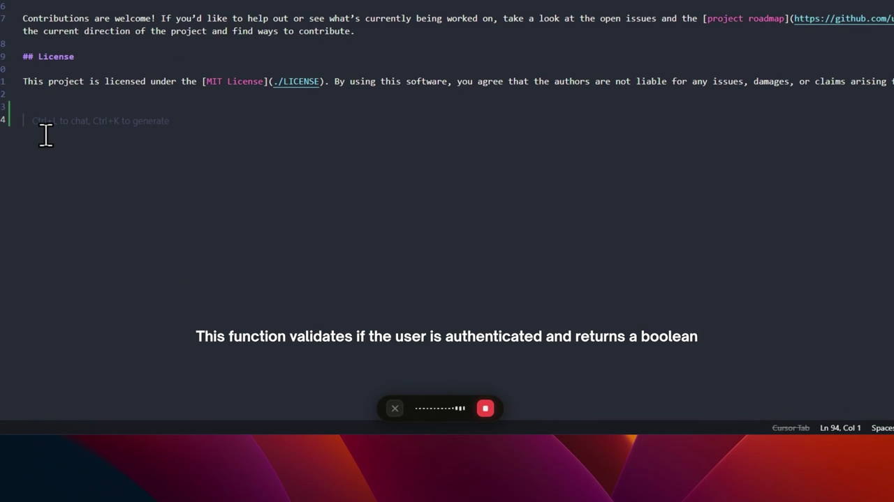

<p align="center">
  
</p>

<p align="center">
  <strong>Free, open source voice-to-text for Windows.</strong><br>
  Hold a hotkey, speak, release — clean text appears at your cursor. Everywhere.
</p>

<p align="center">
  <a href="https://github.com/dictto-app/dictto/releases/latest"></a>&nbsp;
  <a href="https://github.com/dictto-app/dictto/releases"></a>&nbsp;
  <a href="LICENSE"></a>&nbsp;
  <a href="https://github.com/dictto-app/dictto/actions/workflows/release.yml"></a>
</p>

<p align="center">
  <a href="https://github.com/dictto-app/dictto/releases/latest"><b>Download for Windows</b></a> · <a href="#how-it-works">How It Works</a> · <a href="#features">Features</a> · <a href="#build-from-source">Build</a> · <a href="CONTRIBUTING.md">Contributing</a>
</p>

<br>

<p align="center">
  <a href="https://github.com/dictto-app/dictto/blob/main/.github/assets/demo.mp4">
    
  </a>
</p>
<p align="center">
  <sub><b>▶ Click to watch the demo</b> — Hold a hotkey, speak, release. Text appears at your cursor in ~2 seconds.</sub>
</p>

<br>

## How It Works

Dictto uses a push-to-talk model. No always-on microphone, no wake words, no background listening.

| Step | What happens |
|:---:|---|
| **1. Press** | Hold `Ctrl + Win` — Dictto starts recording from your microphone |
| **2. Speak** | Talk naturally. A floating waveform bar shows you it's listening |
| **3. Release** | Let go — audio is sent to OpenAI Whisper for transcription |
| **4. Done** | AI cleans up filler words, fixes grammar, and pastes the text at your cursor |

The entire flow takes about 1–2 seconds after you stop speaking. Audio is never saved to disk.

## Why Dictto?

- **Works everywhere** — Any text field in any app. VS Code, Slack, Notepad, Chrome, Word, Telegram — if you can type there, Dictto can paste there.
- **Your keys, your data** — Bring your own OpenAI API key (BYOK). Audio goes directly from your device to OpenAI. No middleman, no Dictto servers.
- **Actually private** — Zero telemetry, zero analytics, zero accounts. Your API key lives in Windows Credential Locker. [Read our privacy policy →](PRIVACY.md)
- **Open source** — Fully auditable. AGPL-3.0 licensed. You can read every line of code that touches your microphone and your clipboard.

> If you've used [Wispr Flow](https://wisprflow.ai/), [SuperWhisper](https://superwhisper.com/), or other AI dictation tools and wanted something open source, private, and free — Dictto is built for you.

## Features

- **Push-to-talk** — `Ctrl + Win` hotkey. Speak only when you want. No always-on microphone.
- **AI text cleanup** — GPT removes "um", "uh", "like", fixes grammar, and formats your text naturally.
- **102 languages** — Supports all languages available in OpenAI Whisper, including mixed-language dictation (Spanglish, Franglais, etc.).
- **Lightweight** — ~5 MB installer. Built with Tauri + Rust, not Electron. Minimal CPU and memory usage.
- **Smart clipboard** — Saves your clipboard before pasting, restores it after. Your clipboard history stays intact.
- **Auto-start** — Optionally starts with Windows and lives quietly in your system tray.
- **Transcription history** — All your transcriptions are saved locally in a SQLite database for your reference.
- **Fully offline-capable architecture** — The app itself runs locally. Only the API calls go to OpenAI (using your key).

## Install

### Download

Download the latest installer from **[GitHub Releases](https://github.com/dictto-app/dictto/releases/latest)**.

### Setup

1. Run `Dictto_x64-setup.exe`
2. Open Dictto from the system tray (bottom-right of your taskbar)
3. Go to **Settings → API** and enter your [OpenAI API key](https://platform.openai.com/api-keys)
4. Hold `Ctrl + Win` and start talking

### Windows SmartScreen

> [!NOTE]
> **You may see a "Windows protected your PC" screen.** This is expected and safe — here's why.
>
> Windows SmartScreen flags apps that are **not code-signed with a paid certificate**. Most open source projects — including Dictto — don't have one yet because certificates cost hundreds of dollars per year.
>
> **This is not a virus warning.** It's a "we don't recognize this publisher" warning. Dictto is fully open source — you can [audit every line of code](https://github.com/dictto-app/dictto) that runs on your machine.
>
> **To install:**
> 1. Click **"More info"** (the small text link, not the button)
> 2. Click **"Run anyway"**
>
> We are applying for a free code signing certificate through [SignPath Foundation](https://signpath.org/) (used by major open source projects). Once approved, this warning will disappear.
>
> **Verify your download:** Every release includes SHA-256 checksums. Compare with:
> ```powershell
> certutil -hashfile Dictto_0.1.0_x64-setup.exe SHA256
> ```

## Privacy

Dictto is designed to be private by default:

| | |
|---|---|
| **Telemetry** | None. Zero analytics, zero crash reports, zero tracking. |
| **Audio** | Sent directly to OpenAI via your API key. Never stored on disk. Never sent to Dictto. |
| **API key** | Stored in Windows Credential Locker (OS-level encryption). Never logged or transmitted. |
| **Accounts** | None required. No sign-up, no email, no database. |
| **Data storage** | Settings and transcription history stored locally in `%LOCALAPPDATA%`. |

Read the full [Privacy Policy →](PRIVACY.md)

## Tech Stack

| Layer | Technology |
|---|---|
| **Desktop framework** | [Tauri v2](https://v2.tauri.app/) (Rust backend + WebView frontend) |
| **Frontend** | React 19 + TypeScript + TailwindCSS v4 |
| **Audio capture** | WASAPI (native Windows audio via Microsoft `windows` crate) |
| **Transcription** | [OpenAI Whisper API](https://platform.openai.com/docs/guides/speech-to-text) (BYOK) |
| **Text cleanup** | [OpenAI GPT](https://platform.openai.com/docs/guides/text-generation) (BYOK) |
| **Local storage** | SQLite (settings + history) + Windows Credential Locker (API key) |

## Build from Source

**Prerequisites:** [Node.js](https://nodejs.org/) (LTS), [pnpm](https://pnpm.io/), [Rust](https://rustup.rs/) (stable), [Tauri CLI prerequisites](https://v2.tauri.app/start/prerequisites/)

```bash
git clone https://github.com/dictto-app/dictto.git
cd dictto
pnpm install
pnpm dev          # Development mode with hot-reload
pnpm build        # Production build (.exe installer)
```

See [CONTRIBUTING.md](CONTRIBUTING.md) for detailed setup instructions.

## Alternatives

Looking for voice-to-text on other platforms or with different trade-offs? Here are some alternatives:

| App | Platform | Open Source | Price | Key Difference |
|---|---|---|---|---|
| **Dictto** | Windows | Yes (AGPL-3.0) | Free (BYOK) | Push-to-talk, local-first, your own API key |
| [Wispr Flow](https://wisprflow.ai/) | macOS, Windows | No | $12/mo | Closed source, subscription model |
| [SuperWhisper](https://superwhisper.com/) | macOS, Windows | No | $8.49/mo | Closed source, local Whisper model option |
| [Whisper Writer](https://github.com/savbell/whisper-writer) | Windows, Linux | Yes | Free | Python-based, local Whisper, no text cleanup |
| [Buzz](https://github.com/chidiwilliams/buzz) | Cross-platform | Yes | Free | Transcription GUI, not push-to-talk dictation |

## Contributing

Contributions are welcome! See [CONTRIBUTING.md](CONTRIBUTING.md) for setup instructions and guidelines.

## License

[AGPL-3.0](LICENSE) — You can use, modify, and distribute Dictto freely. If you modify it and offer it as a service, you must share your changes under the same license.

<br>

<p align="center">
  Built with <a href="https://v2.tauri.app/">Tauri</a> and <a href="https://www.rust-lang.org/">Rust</a>.
</p>
